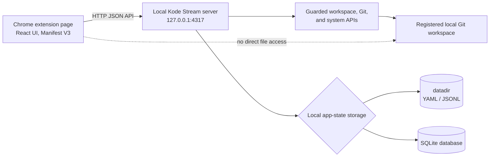

# Chrome Extension Architecture

The Chrome extension is an unpacked Local-mode showcase distribution. It packages the React UI as a Manifest V3
extension page, but it does not move Kode Stream's privileged work into Chrome. The extension calls a separately
started local Kode Stream server, which continues to enforce the normal guarded filesystem and Git APIs.

Source: [chrome-extension.mmd](chrome-extension.mmd).

## Use case

Use the extension when demonstrating or evaluating a Chrome-hosted Kode Stream UI while retaining the normal Local-mode
security and repository boundary. Build it with `npm run build:extension`, load `dist/chrome-extension` through
`chrome://extensions`, and run a local server on port 4317.

The extension defaults to `http://127.0.0.1:4317`; a developer may override that origin through
`localStorage.kodeStreamApiOrigin` for a different local port.

## Deliberate limits

- No direct `file://` access or Chrome File System Access API.
- No native messaging; the user starts the local server explicitly.
- No embedded terminal in the extension surface.
- No Chrome Web Store distribution in this showcase.

See the [Chrome extension runbook](../../../deploy/chrome-extension.md) for build, load, acceptance, and
troubleshooting steps. See [Local mode](../local-mode/README.md) for the server and storage architecture behind it.
