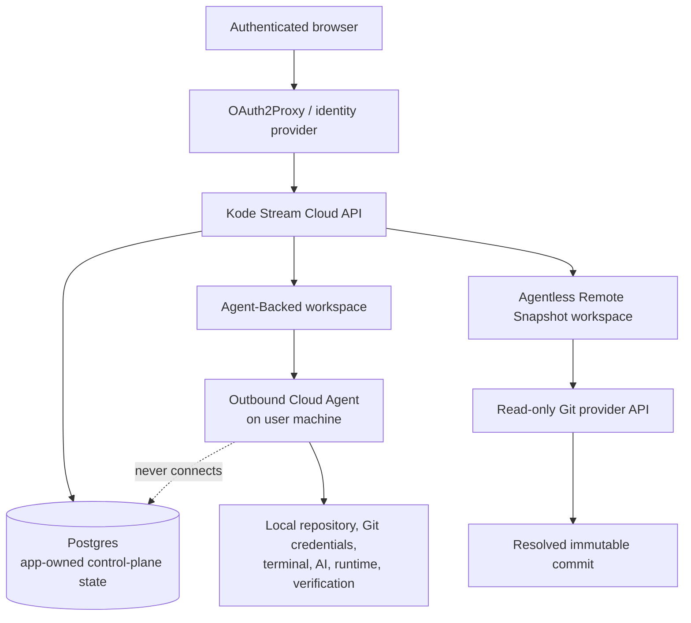

# Cloud Mode Architecture

Cloud mode is a hosted control plane, not a hosted checkout or terminal. It authenticates users, stores shared
app-owned state in Postgres, and provides two workspace access modes with deliberately different trust boundaries.

Source: [cloud-mode.mmd](cloud-mode.mmd).

## Workspace access modes

| Mode                      | Repository boundary                                                                                 | Capabilities                                                                           | Use case                                                      |
|---------------------------|-----------------------------------------------------------------------------------------------------|----------------------------------------------------------------------------------------|---------------------------------------------------------------|
| Agent-Backed              | Repository, credentials, and tools stay on the owner’s machine behind an outbound Agent connection. | Reads and role/Agent-gated file, Git, terminal, AI, runtime, and verification actions. | Hosted collaboration where privileged work must remain local. |
| Agentless Remote Snapshot | Cloud reads an authorized provider repository at a resolved immutable commit.                       | Read-only content, ref selection, and terminal handoff guidance.                       | Safe shared review without a local Agent or checkout.         |

Cloud always uses `KODE_STREAM_STORAGE_OPTION=database`, `KODE_STREAM_STORAGE_DRIVER=postgres`, and a secret-managed
`KODE_STREAM_DATABASE_URL`. Cloud Agents never connect directly to Postgres.

Focused Mermaid diagrams: [Agent-Backed workspace](agent-backed.mmd),
[Agentless Remote Snapshot](agentless-remote-snapshot.mmd), and [Cloud Postgres storage](postgres-storage.mmd).

## Use cases

- Collaborate in a hosted browser UI while retaining repository files and local tooling on a user's machine.
- Review a consistent, commit-pinned provider snapshot without creating a checkout.
- Operate a shared control plane with concurrent writes, migrations, health checks, and managed backups.

For authentication, environment configuration, deployment, and recovery, use [Cloud deployment](../../cloud/cloud-deployment.md).
For the capability matrix and Remote Snapshot operations, use [Cloud deployment modes](../../cloud/cloud-modes.md) and
[Remote Snapshot operations](../../cloud/remote-snapshot-operations.md).
