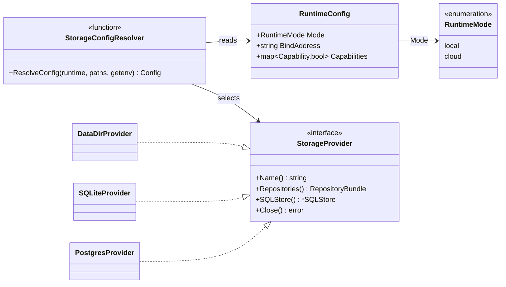
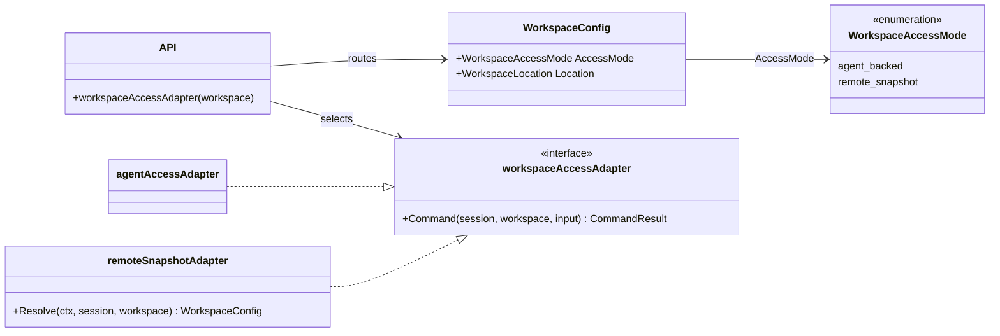
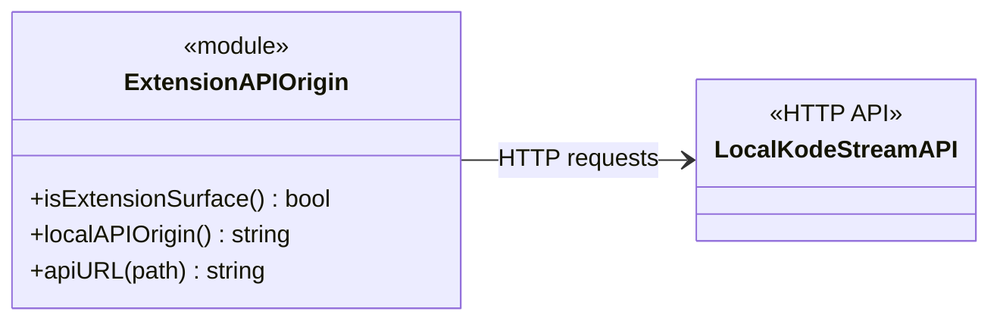

# Deployment Adapter Class Diagrams

Kode Stream does not use a single `DeploymentMode` base interface. The diagrams below show the smaller abstractions that
vary by deployment concern.

## Runtime And Storage

`RuntimeConfig` supplies policy to storage configuration. `StorageProvider` is the concrete persistence seam.

## Cloud Workspace Access

The API selects the command adapter from a workspace's `AccessMode`. Agent-Backed and Remote Snapshot workspaces have
different command boundaries.

## Chrome Extension Surface

The extension is a frontend transport adaptation. It chooses the local API origin; it does not implement a server-side
runtime or workspace-access adapter.

