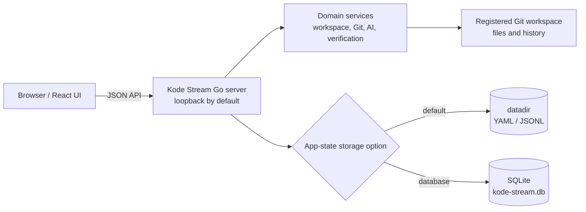

# Local Mode Architecture

Local mode is the single-user Kode Stream runtime. The Go server binds to loopback by default, and it reads and writes
registered repositories on the same machine. It is the mode to use for direct work with files, Git, terminal tools, AI,
runtime commands, and verification.



Source: [local-mode.mmd](local-mode.mmd).

## Storage choices

Local mode has two app-state backends. The choice affects Kode Stream's registry, indexes, audit, navigation state, and
settings; it never changes ownership of the repository files or Git history.

| Option     | Driver | Location                                                  | Best fit                                                              |
|------------|--------|-----------------------------------------------------------|-----------------------------------------------------------------------|
| `datadir`  | file   | YAML and JSONL below `KODE_STREAM_DATA_DIR`               | Simple, inspectable, local state; the default.                        |
| `database` | SQLite | `<KODE_STREAM_DATA_DIR>/kode-stream.db` unless overridden | Indexed queries, transactional updates, and one-file database backup. |

Source: [storage-options.mmd](storage-options.mmd). The detailed option matrix, sync, backup, restore, and performance
guidance remains in [Storage architecture](../../domain/storage/storage-architecture.md).

Each backend also has a focused Mermaid diagram: [data-directory storage](datadir-storage.mmd) and
[SQLite storage](sqlite-storage.mmd).

## Use cases

- An individual working in a local repository or a managed clone.
- A Docker-based local setup with the repository mounted at `/workspace`.
- Local development, including terminal, AI, and verification workflows.

Run with the default data-directory backend:

```bash
kode-stream serve -port 4317
```

Use SQLite instead:

```bash
KODE_STREAM_STORAGE_OPTION=database kode-stream serve -port 4317
```

## Boundary

The browser talks to the loopback API. Kode Stream owns only its app state; repository content stays in the registered
Git workspace and is changed only by explicit user actions. Local mode does not require a Cloud Agent or Postgres.
