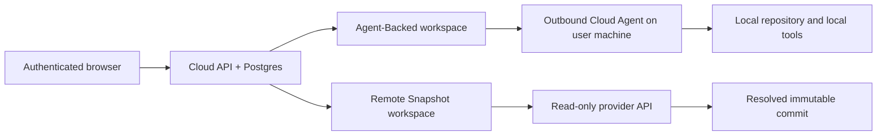

# Cloud Deployment Modes

Cloud is a hosted control plane, not a hosted Git checkout or terminal. Every Cloud deployment uses Postgres for
app-owned state. A workspace then chooses one of two access modes. See [Cloud mode architecture](../../architecture/cloud-mode/README.md)
for the rendered system diagram and a concise use-case guide.

Remote Snapshot is currently a backend foundation: commit-pinned metadata, tree, and file reads are available, while
self-service provider registration, snapshot-backed board/search, and durable provider operations remain follow-up work.

| Workspace access mode | Requires Cloud Agent | Repository source                              | Allowed capabilities                                                                              | Not available                                                                                             |
|-----------------------|----------------------|------------------------------------------------|---------------------------------------------------------------------------------------------------|-----------------------------------------------------------------------------------------------------------|
| Agent-Backed          | Yes                  | User machine                                   | Reads plus role/Agent-gated file, Git, terminal, AI, runtime, and verification actions            | Hosted repository execution                                                                               |
| Remote Snapshot       | No                   | Authorized Git provider at resolved commit SHA | Current backend: commit-pinned metadata, tree, and file reads; workspace-detail terminal guidance | Local path, dirty state, file writes, Git mutations, terminal, AI, runtime, verification, provider writes |

## Choosing A Mode

- Use Agent-Backed when a user needs to change a working tree, run a command, or use local credentials/tools.
- Use the current Remote Snapshot backend foundation when a caller needs a safe, consistent provider metadata/tree/file view.
- Switching from Remote Snapshot to Agent-Backed is a new workspace access choice; it does not create or mutate a local checkout.

## Storage And Trust Boundary

Cloud stores workspace metadata, derived indexes, audit events, and settings in Postgres. The Cloud API never receives
an Agent-Backed repository checkout, SSH key, terminal transcript, or provider token. Remote Snapshot provider
credentials are user-scoped opaque connection material and are never returned by APIs or written to workspace records.

See [Cloud deployment](cloud-deployment.md), [Cloud Agent](cloud-agent.md), and [Remote Snapshot operations](remote-snapshot-operations.md).
