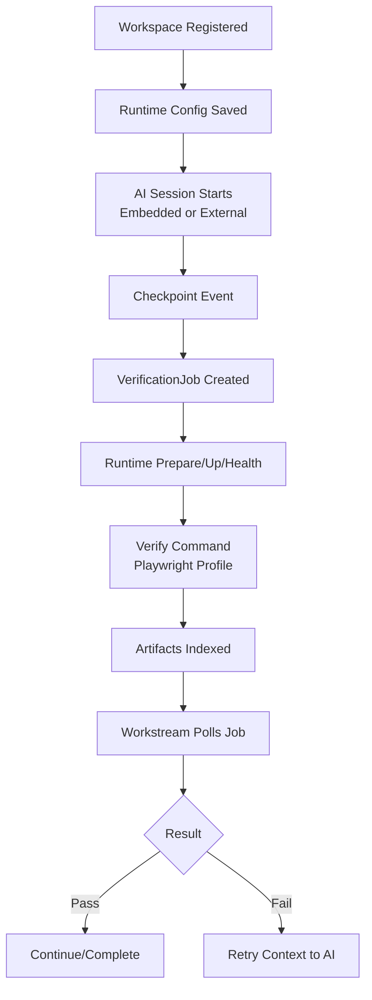
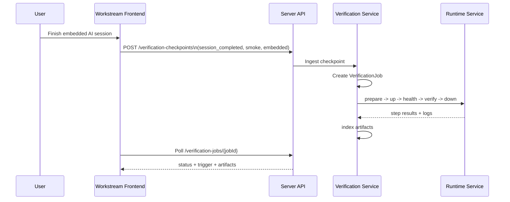
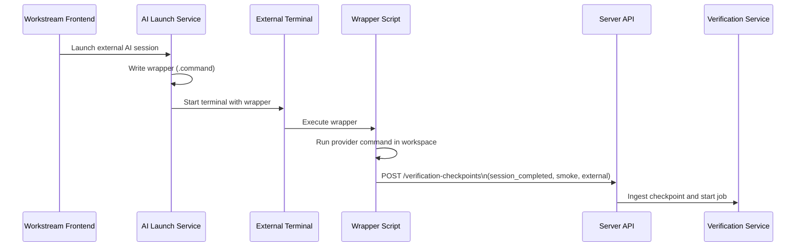
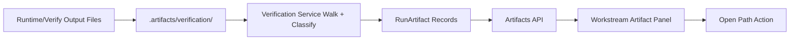

# PM-026: Runtime-Adaptive Verification Harness

PM-026 adds a per-workspace runtime contract so Kode Stream can run, verify, and show application results automatically across different startup styles (`docker-compose`, `Procfile`, `Makefile`, or explicit custom commands). The ticket prioritizes fast iterative verification by defaulting to no-rebuild startup and selective changed-service rebuilds.

## Scope

### Goals

- Define one runtime instruction contract per registered workspace.
- Support pluggable runtime adapters:
  - Docker Compose
  - Procfile-based process managers
  - Makefile command wrappers
  - Custom command adapter for edge cases
- Provide verification profiles (`smoke`, `critical`, `full`) per app.
- Introduce a deterministic `ks verify` contract with standardized exit codes and artifacts.
- Avoid full rebuild loops by default through changed-only rebuild policy and runtime-aware startup.
- Keep the verify loop provider-agnostic across Claude, Codex, OpenCode, and future AI providers.
- Support both embedded terminal sessions and user-integrated external terminals.
- Feed verification failures back into AI implementation sessions as structured retry context.
- Expose run status, logs, screenshots, videos, and Playwright traces in Workstream.

### Non-Goals

- No Kubernetes or remote browser-grid orchestration in this ticket.
- No automatic generation of full end-to-end suites for every workspace.
- No mutation of production deployment pipelines.
- No replacement of existing CI workflows.

## Glossary

| Term | Meaning | Code |
|------|---------|------|
| Runtime Adapter | Strategy used to boot and manage app execution for a workspace | `RuntimeAdapter` |
| App Runtime Contract | Persisted per-workspace instruction set for up/down/verify workflows | `WorkspaceRuntimeConfig` |
| Verification Profile | Named test scope such as smoke, critical, or full | `VerificationProfile` |
| Changed-Only Rebuild | Rebuild only affected services/processes from workspace diffs | `rebuildPolicy=changed-only` |
| Verify Job | One execution of build/start/test/artifact collection | `VerificationJob` |
| Run Artifacts | Logs, report, screenshot, video, and trace outputs | `RunArtifact` |

## Components

| Layer | Component | Purpose |
|-------|-----------|---------|
| Workspace | Runtime contract store and validation | Persist and validate per-workspace execution instructions |
| Runtime | Adapter registry and executors | Uniformly run compose/procfile/makefile/custom strategies |
| Verification | Verify orchestrator | Execute install/build/start/health/test/artifact pipeline |
| AI | Provider bridge and retry context | Consume provider-neutral checkpoints and return failure summaries/artifacts |
| API | Runtime and verify endpoints | Configure contracts, trigger runs, fetch status and artifacts |
| Frontend | Item details verification panel | Show run state, trigger source, timeline, and artifact actions from item details |

## Data Flow

```text
Workspace registered
  -> runtime contract configured
  -> AI session starts implementation task (embedded or external terminal)
  -> provider-neutral checkpoint event triggers verify(profile)
  -> runtime adapter prepares and starts app
  -> health checks pass/fail
  -> Playwright profile executes
  -> artifacts collected and surfaced in Workstream
  -> pass: continue/complete
  -> fail: structured retry context sent back to AI session
```



## Current Implementation Visualization

### Embedded AI Session -> Auto Verify

```text
Workstream (embedded terminal)
  -> terminal session exits/fails/cancels
  -> frontend posts checkpoint:
     POST /api/workspaces/{id}/verification-checkpoints
     { eventType: session_completed, profile: smoke, terminalMode: embedded }
  -> verification service creates VerificationJob
  -> runtime service executes prepare -> up -> health -> verify -> down
  -> artifacts indexed from .artifacts/verification/<job-id>/
  -> Item details page polls /verification-jobs/{jobId}
  -> status, trigger source, steps, and artifact actions are rendered
```



### External Terminal (WezTerm/Terminal/iTerm) -> Auto Verify

```text
User launches external AI session from item
  -> launch service writes wrapper script
  -> wrapper runs provider command in workspace
  -> wrapper posts checkpoint callback on completion
  -> backend ingests checkpoint and starts VerificationJob (smoke)
  -> same verification pipeline and artifact indexing
  -> Item details verification panel shows trigger badge: auto external checkpoint
```



### Artifact Surfacing Pipeline

```text
runtime/verify commands write logs and outputs
  -> .artifacts/verification/<job-id>/...
  -> verification service walks files and indexes RunArtifact records
  -> API returns artifact metadata for the job
  -> Item details panel renders artifact list, Preview dialog, and Open action per artifact path
```



## Design Decisions

| Decision | Alternatives Considered | Rationale |
|----------|-------------------------|-----------|
| Use adapter model per workspace | Hard-code docker-compose only | Different teams already use Compose, Procfile, and Makefile |
| Default to no-build startup | Always rebuild on each run | Keeps iterative loops fast in large microservice repos |
| Add changed-only rebuild policy | Full rebuild or never rebuild only | Balances speed and correctness for multi-service changes |
| Keep profile-based verification | Single global test command | Enables cheap smoke checks and selective escalation |
| Standardize artifact locations | Adapter-specific ad hoc outputs | Makes UI and retry prompts predictable |
| Keep provider-neutral checkpoint contract | Bind execution loop to one AI vendor | Prevents lock-in and keeps behavior consistent per workspace |
| Support embedded and external terminal modes | Support only embedded terminal | Matches current team workflows without changing verify behavior |

## Related Plans

| Ticket | Relationship | Key Context |
|--------|--------------|-------------|
| [PM-020](../PM-020/README.md) | AI terminal foundation | Owns embedded/external AI session workflows |
| [PM-025](../PM-025/README.md) | Workstream surface | Defines flow where verification outputs are consumed |
| [PM-023](../PM-023/README.md) | Backend domain ownership | Guides service/controller placement for new runtime domain |
| [PM-024](../PM-024/README.md) | Workspace config workflows | Establishes registry/config validation and UX patterns |

## Documents

- [Scenario Overview](scenario/scenario-00-overview.md)
- [Backend Design](design/design-01-backend.md)
- [Frontend Design](design/design-02-frontend.md)
- [Implementation Plan](implementation-plan.md)
