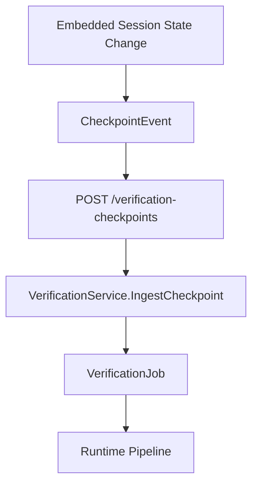
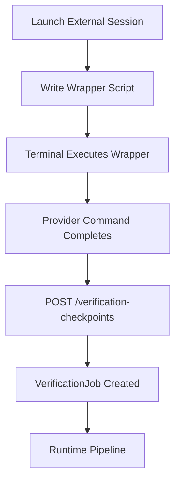
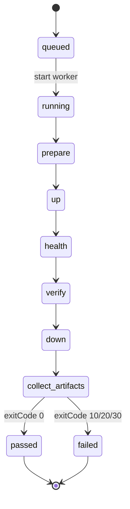

# Backend Design: Runtime-Adaptive Verification Harness

## Overview

Add a workspace-owned runtime contract and a runtime adapter execution layer so Kode Stream can start applications, run profile-based verification, and collect artifacts consistently across Compose, Procfile, Makefile, and custom command workflows. The design prioritizes fast checkpoint loops by defaulting to no-build startup and optional changed-only rebuild behavior.

## Data Model

| Type | Key Fields | Purpose |
|------|------------|---------|
| `WorkspaceRuntimeConfig` | `workspaceId`, `runtimeType`, `configPath`, `commands`, `rebuildPolicy`, `healthChecks`, `artifacts` | Persisted per-workspace runtime instructions |
| `RuntimeCommandSet` | `up`, `down`, `rebuildChanged`, `verify.smoke`, `verify.critical`, `verify.full` | Adapter-agnostic command contract |
| `VerificationJob` | `id`, `workspaceId`, `profile`, `status`, `failureType`, `startedAt`, `finishedAt` | Execution lifecycle for one verify run |
| `VerificationStepResult` | `step`, `status`, `durationMs`, `message` | Step-level telemetry for timeline UI |
| `RunArtifact` | `jobId`, `kind`, `path`, `size`, `createdAt` | Indexed artifact metadata (logs, report, trace, video, screenshot) |
| `RetryContext` | `jobId`, `failureType`, `summary`, `artifactRefs` | Normalized payload for AI retry loop |
| `AICheckpointEvent` | `provider`, `sessionId`, `workspaceId`, `itemId`, `terminalMode`, `eventType`, `createdAt` | Provider-neutral trigger input for verification |

## API Contract

| Method | Endpoint | Request | Response |
|--------|----------|---------|----------|
| GET | `/api/workspaces/{id}/runtime` | None | `WorkspaceRuntimeConfig` |
| PUT | `/api/workspaces/{id}/runtime` | `WorkspaceRuntimeConfig` | Saved config |
| POST | `/api/workspaces/{id}/verification-jobs` | `CreateVerificationJobInput` | `VerificationJob` |
| POST | `/api/workspaces/{id}/verification-checkpoints` | `CheckpointEvent` | `VerificationJob` |
| GET | `/api/workspaces/{id}/verification-jobs/{jobId}` | None | `VerificationJobDetail` |
| GET | `/api/workspaces/{id}/verification-jobs/{jobId}/artifacts` | None | `RunArtifact[]` |
| POST | `/api/workspaces/{id}/verification-jobs/{jobId}/rerun` | `profile` | New `VerificationJob` |

## Domain Boundary

| Domain | Package | Ownership |
|--------|---------|-----------|
| Workspace | `internal/workspace` | Workspace settings persistence and runtime contract ownership |
| Runtime | `internal/runtime` | Adapter registry, command execution, health checks, teardown |
| Verification | `internal/verification` | Job orchestration, status transitions, artifact indexing |
| AI | `internal/ai` | Provider-neutral checkpoint and retry-context bridge into active sessions |
| Server API | `internal/server/api` | HTTP contracts, validation, and service delegation |

## Provider-Agnostic AI Contract

- PM-026 does not depend on one AI vendor protocol.
- AI integrations map provider-specific session events into `AICheckpointEvent`.
- Minimum required checkpoint fields:
  - `provider` (for observability only)
  - `sessionId`
  - `workspaceId`
  - `eventType` (`step_completed`, `manual_checkpoint`, or `session_completed`)
  - `terminalMode` (`embedded` or `external`)
- Verification orchestration consumes this normalized event and never branches on provider identity.
- If a provider cannot emit step events, fallback triggers are manual rerun and file-change thresholds.

## Implemented Under-The-Hood Flows

### Embedded Checkpoint Ingestion

```text
embedded session state changes to exited/failed/cancelled
  -> frontend sends CheckpointEvent (session_completed, smoke, embedded)
  -> POST /api/workspaces/{id}/verification-checkpoints
  -> verification service creates VerificationJob
  -> verification worker runs runtime pipeline
```



### External Terminal Checkpoint Ingestion

```text
Launch() creates wrapper script and starts external terminal
  -> wrapper executes provider command
  -> wrapper posts CheckpointEvent to verification-checkpoints endpoint
  -> verification service creates VerificationJob
  -> runtime pipeline runs with same job model
```



### Verification Worker Pipeline

```text
VerificationJob queued
  -> prepare (rebuild policy)
  -> up
  -> health
  -> verify(profile command)
  -> down
  -> collect artifacts + classify kinds
  -> publish passed/failed with exit code + failure type
```



## Terminal Session Support

- Verification jobs are executed by Kode Stream workers, not by terminal process ownership.
- Terminal mode only affects session UX and telemetry attribution.
- Embedded and external terminals must produce equivalent checkpoint behavior and retry payloads.
- External terminals (for example WezTerm) use the same backend verify APIs through session integration hooks.

## Adapter Execution Model

- `RuntimeAdapter` interface:
  - `Validate(config) error`
  - `Prepare(ctx, request) result`
  - `Up(ctx, request) result`
  - `Health(ctx, request) result`
  - `Verify(ctx, request) result`
  - `Down(ctx, request) result`
- Implementations:
  - `DockerComposeAdapter`
  - `ProcfileAdapter`
  - `MakefileAdapter`
  - `CustomCommandAdapter`
- Adapter outputs normalize command logs, exit status, and structured errors.

## Verification Lifecycle

```text
prepare
  -> optional rebuild phase by policy
  -> up
  -> health checks
  -> verify command by profile
  -> artifact collection
  -> down/teardown
  -> final job status
```

## Rebuild Policy

- `never`: no rebuild step; always attempt reuse.
- `changed-only`: rebuild mapped impacted targets only.
- `always`: force full rebuild before startup.

Changed-only behavior uses workspace diff classification and adapter-specific target mapping. If impact cannot be classified safely, fallback is adapter-defined conservative behavior.

## Failure Classification

| Failure Type | Criteria | Exit Code |
|--------------|----------|-----------|
| `boot_failure` | Up or health phase fails | `10` |
| `test_failure` | Verify command fails after successful health | `20` |
| `infra_failure` | Sandbox, adapter, or runtime execution failure | `30` |

## Artifact Contract

- Canonical artifact root per job:
  - `.artifacts/verification/<job-id>/...`
- Required indexed kinds:
  - `runtime_log`
  - `verify_log`
  - `playwright_report`
  - `playwright_trace` (when available)
  - `playwright_video` (on failure/retry as configured)
  - `playwright_screenshot` (on failure as configured)

## Artifact Surfacing Flow

```text
verification step writes files under job artifact root
  -> verification service indexes files as RunArtifact records
  -> API exposes artifact metadata and secure file access paths
  -> Workstream polls/subscribes to job updates
  -> UI renders links/actions (Open Report, Open Trace, View Logs)
```

Artifacts are immutable per job so users and AI retries inspect the same evidence.

## Design Decisions

| Decision | Rationale |
|----------|-----------|
| Workspace owns runtime config | Runtime behavior is app-specific and belongs to workspace metadata |
| Separate runtime and verification domains | Keeps command execution and job orchestration independently testable |
| Adapter abstraction over direct command branching | Avoids hard-coding compose-only behavior |
| Standardized failure codes | Enables reliable AI retry and UI state handling |
| Changed-only rebuild as first-class policy | Critical for large microservice feedback loops |
| Provider-neutral checkpoint ingestion | Keeps verify loop stable across AI platforms |
| Terminal mode as metadata, not executor | Ensures embedded and external sessions behave identically |
