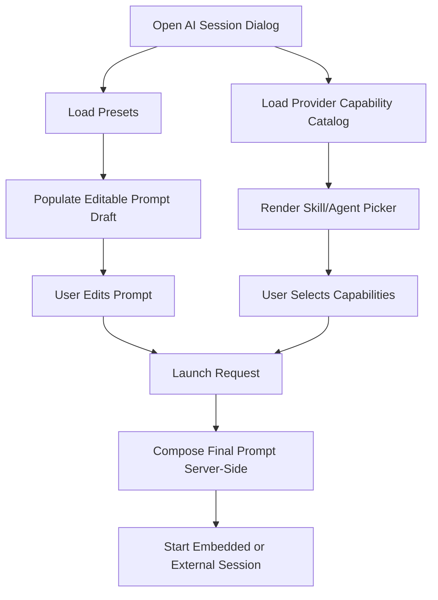

# PM-027: AI Launch Composer, Capability Picker, And Session Layout Modes

PM-027 improves Open AI Session so users can review and edit the exact launch prompt before starting a session, optionally select provider-supported skills/agents that are injected into the launch instruction, and use a more flexible embedded session shell after launch. The ticket also fixes prompt resolution drift where preset selection can still launch with the default static card-context sentence, and expands the current embedded session dialog into movable, resizable, and dockable presentation modes.

## Scope

### Goals

- Add a visible, editable prompt textarea for all AI prompt modes (preset and free prompt).
- Preload selected preset content into the textarea and keep it user-editable before launch.
- Preserve preset identity for audit/analytics while sending the edited prompt text.
- Add provider-aware capability discovery for skills and agents from workspace-local and user-global provider directories, but only from real provider capability entrypoints.
- Let users select only skills/agents that are actually available for the selected provider in the current workspace or on the user machine, and inject them into the launch prompt deterministically.
- Present skills/agents as a compact selector that prioritizes capability names and source paths instead of rendering skill body content inside the picker.
- Support capability injection for both embedded and external AI sessions.
- Fix baseline prompt construction so preset text is actually used by default provider templates.
- Make the floating embedded session window movable within the viewport.
- Make the floating embedded session window resizable from all four corners with bounded minimum and maximum dimensions.
- Add a right-side panel mode that uses full application height to simulate chat-style AI interaction.
- Let users switch the same running embedded session between floating and right-side panel modes without relaunching.
- Keep floating/session layout safely on-screen during the current app session.

### Non-Goals

- No autonomous background multi-agent orchestration in this ticket.
- No per-user persistent library of custom presets yet.
- No cross-provider guarantee that native skill/agent switches exist.
- No replacement of provider executable detection/settings workflow.
- No detached OS-native window outside the application shell.
- No backend-owned persistence requirement for panel position; client-side persistence is sufficient for this ticket.

## Glossary

| Term | Meaning | Code |
|------|---------|------|
| Prompt Composer | Launch-time instruction text assembled from preset/free prompt + optional capability directives | `LaunchPromptComposer` |
| Prompt Draft | Editable prompt content shown in the Open AI Session dialog | `promptDraft` |
| Capability Catalog | Provider-specific list of selectable skills and agents | `ProviderCapabilityCatalog` |
| Capability Scope | Whether a discovered capability comes from the current workspace or the user machine | `workspace | global` |
| Capability Injection | Prompt augmentation with selected skill/agent directives | `CapabilitySelection` |
| Native Capability Mode | Provider supports explicit skill/agent flags/arguments | `supportsNativeSelection` |
| Fallback Injection Mode | Provider lacks native capability flags; directives are appended to prompt text | `prompt_fallback` |
| Floating Session Mode | Embedded session shown as an overlay window that can move and resize | `floating` |
| Right Panel Mode | Embedded session docked to the right side at full app height | `side_panel` |
| Session Layout State | Client-owned position, size, and presentation mode for embedded sessions | `EmbeddedSessionLayoutState` |

## Components

| Layer | Component | Purpose |
|-------|-----------|---------|
| AI Service | Prompt composer and capability catalog service | Resolve preset/free prompt, merge selections, and return final launch instruction |
| API | Preset and provider-capability endpoints | Expose prompt/capability contracts to frontend, with item/workspace-aware provider discovery |
| Frontend | Open AI Session dialog | Prompt editor, preset sync behavior, skill/agent picker, and validation |
| Frontend | Embedded session shell | Floating window chrome, drag/resize, right-side panel mode, and mode switching |
| Embedded Runtime | Embedded launch input builder | Ensure composed prompt and capability metadata are used for embedded sessions |
| External Runtime | External launch wrapper input builder | Ensure composed prompt and capability metadata are used for external sessions |
| Audit | Launch telemetry | Record launch success/failure for embedded and external sessions |

## Data Flow

```text
User opens Open AI Session
  -> preset list and provider capability catalog are loaded
  -> user selects preset (or free prompt)
  -> preset prompt is inserted into editable textarea
  -> frontend loads provider-matching workspace/global skills and agents for the current item workspace
  -> user edits prompt and optionally selects skills/agents
  -> launch request sends prompt draft + selected capabilities
  -> backend composes final provider instruction
  -> embedded/external session starts with composed prompt
  -> if embedded, user can open session in floating or right-side panel mode
  -> user can drag, resize, minimize, maximize, or switch presentation mode without relaunch
```



## Current Gap To Fix

- Current default provider argument templates use a static card-context sentence rather than the preset `Prompt` value.
- Result: selecting `Create implementation plan`, `Create technical design`, or `Create test scenarios` can still start with the same default sentence.
- PM-027 makes preset/free prompt composition explicit and ensures launch templates consume the composed prompt consistently.
- Current embedded terminal shell supports normal, maximized, and collapsed states, but not free repositioning, bounded resizing, or a right-docked full-height chat-style presentation.
- PM-027 adds those missing layout controls on top of PM-020 rather than replacing the existing embedded session runtime.

## Design Decisions

| Decision | Alternatives Considered | Rationale |
|----------|-------------------------|-----------|
| Keep prompt composition server-side | Build final prompt only in frontend | Server-side composition is consistent across embedded/external launch paths |
| Always show editable prompt textarea | Keep textarea only for free prompt | Users need visibility and control for presets before launch |
| Add provider capability catalog endpoint | Hard-code skill/agent options in frontend | Provider capabilities should be discovered centrally and filtered by provider plus workspace context |
| Discover workspace and global capability sources | Show one generic shared list for all providers | Users should only see entries that the selected provider can actually use in the current workspace/user environment |
| Support fallback prompt injection mode | Block capability selection when no native provider support | Keeps UX useful across providers with uneven feature sets |
| Preserve preset ID even after editing | Drop preset identity once prompt is changed | Maintains traceability in launch results and future analytics |
| Reuse one embedded session shell in multiple layouts | Separate floating terminal and side-panel implementations | Session lifecycle and rendering behavior stay consistent across presentations |
| Keep layout state client-owned | Persist window geometry in backend session records | Layout is local UI state and should not complicate server contracts |
| Bound drag and resize behavior to the visible viewport | Allow free off-screen movement or zero-size panels | Keeps recovery simple and avoids stranded sessions |

## Related Plans

| Ticket | Relationship | Key Context |
|--------|--------------|-------------|
| [PM-020](../PM-020/README.md) | AI session foundation | Owns embedded/external session runtime contracts |
| [PM-025](../PM-025/README.md) | Prompt preset origin | Added preset selection and free-prompt launch controls |
| [PM-026](../PM-026/README.md) | Verification loop integration | Uses AI session launch metadata for checkpoint attribution |

## Documents

- [Scenario Overview](scenario/scenario-00-overview.md)
- [Backend Design](design/design-01-backend.md)
- [Frontend Design](design/design-02-frontend.md)
- [Implementation Plan](implementation-plan.md)
